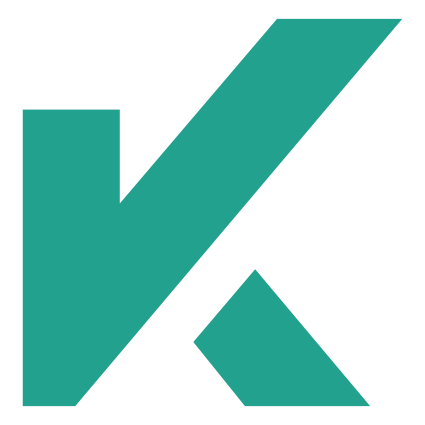

<!doctype html>
<html lang="es">

<head>
    <meta charset="utf-8">
    <meta name="viewport"
        content="width=device-width, initial-scale=1, shrink-to-fit=no, maximum-scale=1.0, user-scalable=0">
    <meta name="Description"
        CONTENT="Author: Kroalca - Alejandro Rodríguez Carrillo, Category: Web developer Frontend Backend Fullstack, Desarrollador de aplicaciones webs">
    <meta name="google-site-verification" content="8prxiTcIs9XHnj4Kb3hIB_ivxr-WXwNt0uDYCD-UvO4" />
    <link rel="canonical" href="https://kroalca.github.io" />
    <link rel="icon" type="image/svg+xml" href="img/logo.svg" sizes="any">

    <link rel="stylesheet" href="https://stackpath.bootstrapcdn.com/bootstrap/4.3.1/css/bootstrap.min.css"
        integrity="sha384-ggOyR0iXCbMQv3Xipma34MD+dH/1fQ784/j6cY/iJTQUOhcWr7x9JvoRxT2MZw1T" crossorigin="anonymous">
    <link href='https://unpkg.com/boxicons@2.0.9/css/boxicons.min.css' rel='stylesheet'>
    <link rel="stylesheet" href="css/style.css">
    <link rel="stylesheet" href="https://cdnjs.cloudflare.com/ajax/libs/animate.css/4.1.1/animate.min.css"/>
    
    <title>Alejandro Rodríguez Carrillo - Web Developer</title>
</head>

<body id="home">
    <header>
        <nav class="navbar navbar-expand-lg fixed-top">
            

                <a class="navbar-brand" href="#home">roalca</a>
                <button class="navbar-toggler" type="button" data-toggle="collapse"
                    data-target="#navbarSupportedContent" aria-controls="navbarSupportedContent" aria-expanded="false"
                    aria-label="Toggle navigation">
                    <i class='bx bx-menu'></i>
                </button>

                

                    <ul class="navbar-nav">
                        <li class="nav-item">
                            <a class="nav-link" href="#about">Perfil</a>
                        </li>
                        <li class="nav-item">
                            <a class="nav-link" href="#skill">Competencias</a>
                        </li>
                        <li class="nav-item">
                            <a class="nav-link" href="#studies">Estudios</a>
                        </li>
                        <li class="nav-item">
                            <a class="nav-link" href="#contact">Contacto</a>
                        </li>
                    </ul>
                

            

        </nav>
    </header>

    <section class="main">
        

            

                

                    

                        <h1>Alejandro Rodríguez Carrillo</h1>
                        <h2></h2>
                        

                            <h2>Web Developer</h2>
                            <h2>Frontend</h2>
                            <h2>Backend</h2>
                            <h2>Fullstack</h2>
                        

                        
Tengo  años y me dedico a la programación web desde hace
                             años,
                            estoy listo para tener más experiencia laboral y aumentar mis conocimientos en el ámbito
                            profesional.

                        <a href="file/cv2021.pdf" class="btn" download="CVAlejandro">Descargar CV</a>
                    

                    

                        <lottie-player src="https://assets2.lottiefiles.com/packages/lf20_uzamaojr.json"
                            class="animacion" background="transparent" speed="0.5" loop autoplay></lottie-player>
                    

                

            

        

    </section>

    <section class="py-5" id="about">
        

            <h3>Perfil</h3>
            

                

                    
                

                

                    
Me defino como una persona responsable, trabajadora, amable y honesta que busca desarrollarse
                        profesional y personalmente. Creo que tengo mucho potencial y sobre todo muchas ganas de
                        trabajar y aprender.

                    
Estos últimos años me he estado formándome profesionalmente en tecnologías webs, poseo algunos
                        conocimientos en framework como React.

                    
También en trabajado con bases de datos(MySQL, Oracle, MongoDB) y adquiero los conocimientos
                        básicos de SEO
                        para posicionar paguinas webs.

                    
Me gustaría dedicarme profesionalmente al desarrollo web.

                    

                        

                            

                                Edad: 
                                <i id="age2"></i>
                            

                            

                                Email: 
                                <a href="mailto:kroalca@gmail.com">kroalca@gmail.com</a>
                            

                            

                                Linkedin: 
                                <a href="https://www.linkedin.com/in/alejandro-rodríguez-carrillo-34a583205">Alejandro<i class='bx bx-link'></i></a>
                            

                            

                                Github: 
                                <a href="https://github.com/Kroalca">Kroalca<i class='bx bx-link'></i></a>
                            

                        

                    

                

            

        

    </section>

    <section class="py-5 gris" id="skill">
        

            <h3>Mis Competencias</h3>
            

                

                    

                        HTML
                    

                    

                        
                    

                

                

                    

                        CSS
                    

                    

                        
                    

                

                

                    

                        JS
                    

                    

                        
                    

                

                

                    

                        PHP
                    

                    

                        
                    

                

                

                    

                        React
                    

                    

                        
                    

                

                

                    

                        Mysql
                    

                    

                        
                    

                

            

        

    </section>

    <section class="py-5" id="studies">
        

            <h3>Mis Estudios</h3>
            

                

                    

                        

                            <i class='bx bx-server mb-4'></i>
                            ASIR
                            
CFGS - IES Siete palmas

                        

                    

                    

                        

                            <i class='bx bx-mobile mb-4'></i>
                            DAM
                            
CFGS - CIFP Villa de Aguimes

                        

                    

                    

                        

                            <i class='bx bx-laptop mb-4'></i>
                            DAW
                            
CP - Focan

                        

                    

                

            

        

    </section>

    <section class="gris" id="contact">
        

            

                

                    <h4>Enviame un mensaje</h4>
                    <form id="form">
                        <input type="text" class="form-control my-3" placeholder="Nombre" aria-label="Name"
                            aria-describedby="Name" id="contact_name" required>
                        <input type="email" class="form-control my-3" placeholder="Email" aria-label="Email"
                            aria-describedby="Email" id="contact_email" required>
                        <input type="text" class="form-control mb-3" placeholder="Asunto" aria-label="Subject"
                            aria-describedby="Subject" id="contact_subject" required>
                        <textarea class="form-control mb-3" placeholder="Mensaje" id="contact_message"
                            style="height: 150px" required></textarea>
                        <input type="submit" class="btn" value="Enviar">
                    </form>
                

                

                    <h4>Información de contacto</h4>
                    

                        <h5>Localización</h5>
                        
España

                        
Gran Canaria

                        
Vecindario

                    

                    

                        <h5>Email</h5>
                        
kroalca@gmail.com

                    

                    

                        <a href="mailto:kroalca@gmail.com"><i class='bx bx-message'></i></a>
                        <a href="https://github.com/Kroalca"><i class='bx bxl-github mx-2'></i></a>
                        <a href="https://www.linkedin.com/in/alejandro-rodríguez-carrillo-34a583205"><i
                                class='bx bxl-linkedin'></i></a>
                    

                

            

        

    </section>

    <footer class="py-3">
        

            <h5>© 2021 Copyright: Kroalca</h5>
            

                <a href=""><i class='bx bxl-github mb-2'></i></a>
                <a href=""><i class='bx bxl-linkedin'></i></a>
            

        

    </footer>

    <!-- Optional JavaScript -->
    <!-- jQuery first, then Popper.js, then Bootstrap JS -->
    
    
    
    
    
    
    
    
    
</body>

</html>